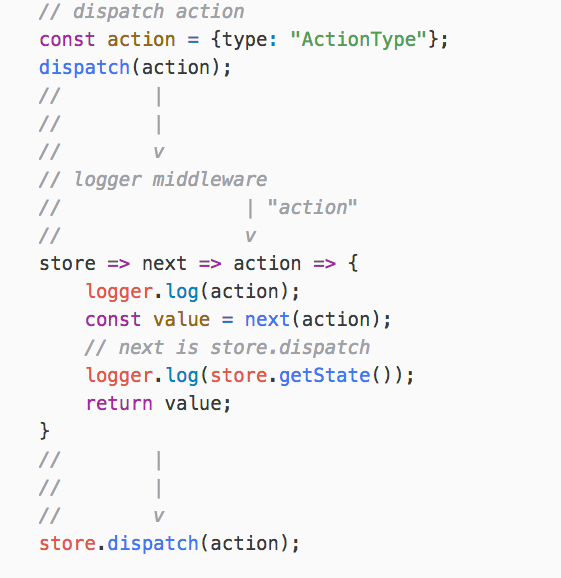

# Redux

> この文章は[Redux][] [3.5.2](https://github.com/reactjs/redux/releases/tag/v3.5.2 "3.5.2")を元に書かれています。

[Redux][]はJavaScriptアプリケーションのStateを管理するライブラリで、
[React](https://github.com/facebook/react "React")などと組み合わせアプリケーションを作成するために利用されています。

Reduxは[Flux](https://facebook.github.io/flux/ "Flux")アーキテクチャに類似する仕組みです。
そのため、事前にFluxについて学習しているとよいです。

Reduxには[Three Principles](http://redux.js.org/docs/introduction/ThreePrinciples.html "Three Principles | Redux")(以下、三原則)と呼ばれる3つの制約の上で成立しています。

- Single source of truth
    - アプリケーション全体のStateは1つのStateツリーとして保存される
- State is read-only
    - StateはActionを経由しないと書き換えることができない
- Changes are made with pure functions
    - Actionを受け取りStateを書き換えるReducerと呼ばれるpure functionを作る

この三原則についての詳細はドキュメントなどを参照してください。

- [Read Me | Redux](http://redux.js.org/)
- [Getting Started with Redux - Course by @dan_abramov @eggheadio](https://egghead.io/series/getting-started-with-redux)

Reduxの使い方についてはここでは解説しませんが、Reduxの拡張機能となる _middleware_ も、この三原則に基づいた仕組みとなっています。

_middleware_ という名前からも分かるように、[Connect](../connect/README.md)の仕組みと類似点があります。
[Connect](../connect/README.md)の違いを意識しながら、Reduxの _middleware_ の仕組みを見ていきましょう。

## どう書ける?

簡潔にReduxの仕組みを書くと次のようになります。

- 操作を表現するオブジェクトをActionと呼ぶ
    - 一般的なコマンドパターンのコマンドと同様のもの
- Actionを受け取りStateを書き換える関数を _Reducer_ と呼ぶ
    - ReducerはStoreへ事前に登録する
- ActionをDispatch(`store.dispatch(action)`)することで、ActionをReducerへ通知する

Reduxの例として次のようなコードを見てみます。

[import, redux-example.js](../../src/Redux/redux-example.js)

1. `logger`と`crashReporter`のmiddlewareを適用した`createStore`関数を作る
2. Reducerを登録したStoreを作成
3. (Storeの変更をする)Actionをdispatch
4. Actionを受け取り新しいStateを返すReducer関数
5. Stateが変更されたら呼ばれる

というような流れで動作します。

上記の処理のうち、 3から4の間が _middleware_ が処理する場所となっています。

```
dispatch(action) -> (_middleware_ の処理) -> reducerにより新しいStateの作成 -> (Stateが変わったら) -> subscribeで登録したコールバックを呼ぶ
```


via [staltz.com/unidirectional-user-interface-architectures.html](http://staltz.com/unidirectional-user-interface-architectures.html)o

次は _middleware_ によりどのような拡張ができるのかを見ていきます。

## middleware

Reduxでは第三者が拡張できる仕組みを _middleware_ と呼んでいます。

- [Middleware | Redux](http://redux.js.org/docs/advanced/Middleware.html "Middleware | Redux")

どのような拡張を _middleware_ で書けるのか、実際の例を見てみます。
次の _middleware_ はStoreがdispatchしたActionと、その前後でStateにどのような変更があったのかを出力するロガーです。

[import, logger.js](../../src/Redux/logger.js)

この _middleware_ は次のようにReduxに対して適用できます。

```js
import {createStore, applyMiddleware} from "redux";
const createStoreWithMiddleware = applyMiddleware(createLogger())(createStore);
```

このとき、見た目上は `store` に対して _middleware_ が適用されているように見えますが、
実際には`store.dispatch`に対して適用され、拡張された`dispatch`メソッドが作成されています。

これにより、`dispatch`を実行する際に _middleware_ の処理を挟むことができます。
これがReduxの _middleware_ による拡張ポイントになっています。

```js
store.dispatch({
    type: "AddTodo",
    title: "Todo title"
});
```

先ほどの`logger.js`をもう一度見てみます。

```js
export default function createLogger(options = defaultOptions) {
    const logger = options.logger || defaultOptions.logger;
    return store => next => action => {
        logger.log(action);
        const value = next(action);
        logger.log(store.getState());
        return value;
    };
}
```

`createLogger`は、loggerにオプションを渡すためのものなので置いておき、
`return`している高階関数の連なりが _middleware_ の本体となります。

```js
const middleware = store => next => action => {};
```

上記のArrowFunctionの連なりが一見すると何をしているのかが分かりにくいですが、
これは次のように展開することができます。

```js
const middleware = (store) => {
    return (next) => {
        return (action) => {
            // Middlewareの処理
        };
    };
};
```

ただ単に関数を返す関数(高階関数)を作っているだけだと分かります。

これを踏まえて`logger.js`をもう一度見てみると、`next(action)` の前後にログ表示を挟んでいることが分かります。

[import, logger.js](../../src/Redux/logger.js)


この _middleware_ は次のようなイメージで動作します。



この場合の `next` は `dispatch` と言い換えても問題ありませんが、複数の _middleware_ を適用した場合は、
**次の** _middleware_ を呼び出すということを表現しています。

Reduxの _middleware_ の仕組みは単純ですが、見慣れないデザインなので複雑に見えます。
実際に同じ仕組みを実装しながら、Reduxの _middleware_ について学んでいきましょう。

## どのような仕組み?

_middleware_ は`dispatch`をラップする処理ですが、そもそも`dispatch`とはどういうことをしているのでしょうか?

簡潔に書くと、Reduxの`store.dispatch(action)`は`store.subscribe(callback)`で登録した`callback`に`action`を渡し呼び出すだけです。

これはよくみるPub/Subのパターンですが、今回はこのPub/Subパターンの実装からみていきましょう。

### Dispatcher

[ESLint](../ESLint/README.md)と同様でEventEmitterを使い、`dispatch`と`subscribe`をもつ`Dispatcher`を実装すると次のようになります。

[import, Dispatcher.js](../../src/Redux/Dispatcher.js)

`Dispatcher`はActionオブジェクトを`dispatch`すると、`subscribe`で登録されていたコールバック関数を呼び出すという単純なものです。

また、この`Dispatcher`の実装はReduxのものとは異なるので、あくまで理解のための参考実装です。

> Unlike Flux, Redux does not have the concept of a Dispatcher.
> This is because it relies on pure functions instead of event emitters
> -- [Prior Art | Redux](http://redux.js.org/docs/introduction/PriorArt.html "Prior Art | Redux")

### applyMiddleware

次に、 _middleware_ を適用する処理となる `applyMiddleware`を実装していきます。
先ほども書いたように、 _middleware_ は `dispatch` を拡張する仕組みです。

`applyMiddleware`は`dispatch`と _middleware_ を受け取り、 _middleware_ で拡張した `dispatch` を返す関数です。

[import, apply-middleware.js](../../src/Redux/apply-middleware.js)

この`applyMiddleware`はReduxのものと同じなので、
次のように _middleware_ を適用した `dispatch` 関数を作成できます。

[import, apply-middleware-example.js](../../src/Redux/apply-middleware-example.js)

`applyMiddleware`で`timestamp`をActionに付加する _middleware_ を適用しています。
これにより`dispatchWithMiddleware(action)`した`action`には自動的に`timestamp`プロパティが追加されています。

```js
const dispatchWithMiddleware = applyMiddleware(createLogger(), timestamp)(middlewareAPI);
dispatchWithMiddleware({type: "FOO"});
```

ここで _middleware_ には`middlewareAPI`として定義した2つのメソッドをもつオブジェクトが渡されています。
しかし、`getState`は読み込みのみで、_middleware_にはStateを直接書き換える手段が用意されていません。
また、もう1つの`dispatch`もActionオブジェクトを書き換えられますが、結局できることは`dispatch`するだけです。

このことから _middleware_ にも三原則が適用されていることが分かります。

- State is read-only
    - StateはActionを経由しないと書き換えることができない

_middleware_ という仕組み自体は[Connect](../connect/README.md)と似ています。
しかし、 _middleware_ が直接的に結果(State)を直接書き換えることはできません。

Connectの _middleware_ は最終的な結果(`response`)を書き換えできます。
一方、Reduxの _middleware_ は扱える範囲が「`dispatch`からReducerまで」と線引されている違いといえます。

## どういうことに向いている?

Reduxの _middleware_ そのものも三原則に基づいた仕組みとなっています。
_middleware_ はActionオブジェクトを自由に書き換えたり、Actionを無視したりできます。
一方、Stateを直接は書き換えることができません。

多くのプラグインの仕組みでは、プラグインに特権的な機能を与えていることが多いですが、
Reduxの _middleware_ は書き込みのような特権的な要素も制限されています。

_middleware_ に与えられている特権的なAPIとしては、`getState()` と `dispatch()`ですが、
どちらも書き込みをするようなAPIではありません。

このように、プラグインに対して一定の権限をもつAPIを与えつつ、
原則を壊すような特権を与えないことを目的としている場合に向いています。

## どういうことに向いていない?

一方、プラグインにも書き込み権限を与えないためには、
プラグイン間でやり取りする中間的なデータが必要になります。

ReduxではActionオブジェクトというような命令(コマンド)を表現したオブジェクトに対して、
Reducerという命令を元に新しいStateを作り出す仕組みを設けていました。

つまり、プラグインそのものだけですべての処理が完結するわけではありません。
プラグインで処理した結果を受け取り、その結果を処理する実装も同時に必要となっています。
Reduxでは _middleware_ を前提とした処理を実装として書くことも多いです。

そういう意味ではプラグインと実装が密接といえるかもしれません。

そのため、プラグインのみで全処理が完結するような機能を作る仕組みは向いていません。

## まとめ

ここでは[Redux][]のプラグインアーキテクチャについて学びました。

- Reduxの _middleware_ はActionオブジェクトに対する処理を書ける
- _middleware_ に対しても三原則が適用されている
- _middleware_ に対しても扱える機能の制限を適用しやすい
- _middleware_ のみですべての処理が完結するわけではない

## 参考

- [Middleware | Redux](http://redux.js.org/docs/advanced/Middleware.html)
- [10. Middleware · happypoulp/redux-tutorial Wiki](https://github.com/happypoulp/redux-tutorial/wiki/10.-Middleware)
- [Brian Troncone – Redux Middleware: Behind the Scenes](http://briantroncone.com/?p=529)
- [ReduxのMiddlewareについて理解したいマン | moxt](https://hogehuga.com/post-1123/)
- [Understanding Redux Middleware — Medium](https://medium.com/@meagle/understanding-87566abcfb7a#.8fr4jmjwz)

[Redux]: https://github.com/reactjs/redux  "reactjs/redux: Predictable state container for JavaScript apps"
